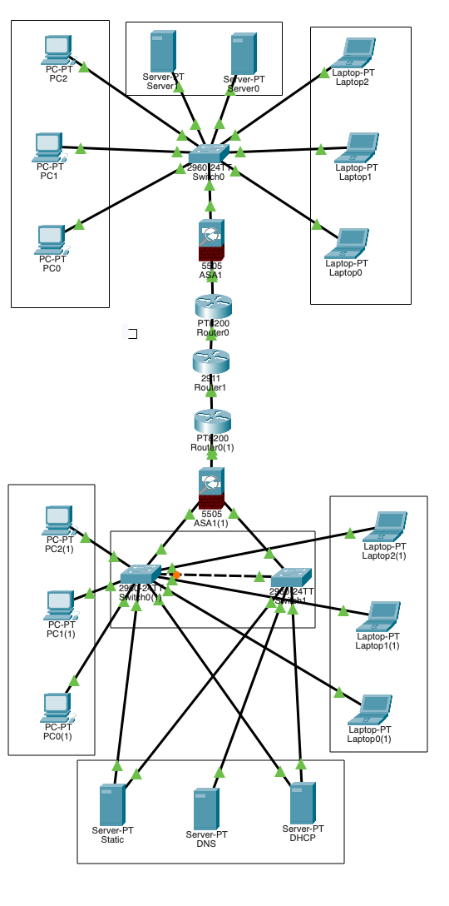

# Enterprise Network Simulation

A multi-site enterprise network
built from scratch in Cisco
Packet Tracer over 2 days.

## Architecture Overview

## What's Built

### Region 1 (HQ) — 192.168.1.0/24
→ Cisco ASA 5505 Firewall
→ PT8200 Edge Router
→ Cisco 2960 Switch
→ DHCP + DNS Server
→ Web Server
→ 6 End Devices

### Region 2 (Branch) — 192.168.2.0/24
→ Cisco ASA 5505 Firewall
→ PT8200 Edge Router
→ Dual Switch (redundancy)
→ DHCP + DNS Server
→ Static + Web Servers
→ 6 End Devices

### WAN
→ Simulated ISP (Cisco 2911)
→ Inter-region routing
→ Cross-region HTTP access

## IP Scheme
| Device | IP | Role |
|--------|-----|------|
| ASA1 inside | 192.168.1.1 | R1 Gateway |
| ASA2 inside | 192.168.2.1 | R2 Gateway |
| ISP Router | 203.0.113.1 / 203.0.114.1 | WAN |

## Problems Solved
1. Subnet conflict between regions
2. Wrong static routes
3. Cloud-PT cannot route between sites
4. ASA blocking cross-region traffic
5. DNS resolution failures

## Concepts Demonstrated
→ Star topology + SPoF
→ Multi-site WAN routing
→ Firewall zones and ACLs
→ NAT/PAT translation
→ DHCP and DNS services
→ Switch redundancy
→ STP loop prevention

## Kubernetes Mapping
| Network Concept | Kubernetes Equivalent |
|----------------|----------------------|
| Switch (CNI) | Pod networking |
| ASA Firewall | NetworkPolicy |
| DNS Server | CoreDNS |
| DHCP/IPAM | Pod IP assignment |
| NAT | kube-proxy |
| VPN | mTLS/service mesh |

