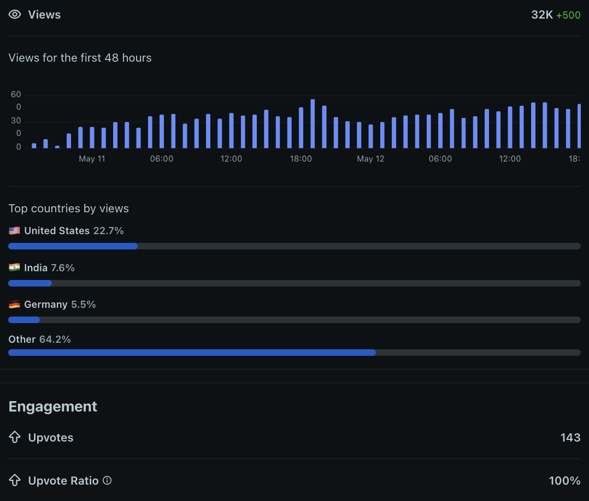

# Enterprise Network Simulation

> Built from scratch in Cisco Packet Tracer over 48 hours —
> **Ranked #1 all-time on r/PacketTracer** with 100% upvote ratio (140+) and 95+ shares.

---

## Community Recognition

```
Platform:      r/PacketTracer
Ranking:       #1 All-Time Top Post
Upvotes:       140+ (and growing)
Upvote ratio:  100%
Shares:        95+
Reach:         United States, India, Germany
```

> Network engineers, CCNA candidates, and infrastructure architects
> across three continents validated this architecture — unanimously.


- Reddit Post: [[reddit-link](https://www.reddit.com/r/packettracer/comments/1t9gu6b/posting_what_i_built_here_since_i_dont_know_what/)]

---

## Overview

A complete two-region enterprise WAN topology demonstrating production-grade
network architecture, security controls, and infrastructure design patterns —
built from first principles by a DevOps engineer going back to networking fundamentals.

---

## Architecture

```
Region 1 (HQ)                         Region 2 (Branch)
192.168.1.0/24                         192.168.2.0/24
      |                                       |
   [ASA1]                               [ASA1(1)]
   Firewall                              Firewall
      |                                       |
   [Router0]                           [Router0(1)]
   PT8200                                PT8200
      |                                       |
      └──────────[ISP Router]────────────────┘
                      |
               [TunnelRouter]
               GRE Tunnel
```

---

## What's Built

### Region 1 — Headquarters
| Component | Device | IP |
|-----------|--------|-----|
| Firewall | Cisco ASA 5505 | 192.168.1.1 inside / 203.0.113.6 outside |
| Edge Router | Cisco PT8200 | 203.0.113.2 / 203.0.113.5 |
| Access Switch | Cisco 2960-24TT | 192.168.1.200 mgmt |
| DHCP + DNS | Server-PT | 192.168.1.100 |
| HTTP Server | Server-PT | 192.168.1.101 |
| End Devices | 3 PCs + 3 Laptops | 192.168.1.10-50 (DHCP) |

### Region 2 — Branch Office
| Component | Device | IP |
|-----------|--------|-----|
| Firewall | Cisco ASA 5505 | 192.168.2.1 inside / 203.0.114.6 outside |
| Edge Router | Cisco PT8200 | 203.0.114.2 / 203.0.114.5 |
| User Switch | Cisco 2960-24TT | 192.168.2.200 mgmt |
| Server Switch | Cisco 2960-24TT | 192.168.2.201 mgmt |
| DHCP + DNS | Server-PT | 192.168.2.100 |
| HTTP Server | Server-PT | 192.168.2.101 |
| Static Server | Server-PT | 192.168.2.102 |
| End Devices | 3 PCs + 3 Laptops | 192.168.2.10-50 (DHCP) |

### WAN Infrastructure
| Component | Device | IP |
|-----------|--------|-----|
| ISP Router | Cisco 2911 | 203.0.113.1 / 203.0.114.1 |
| Tunnel Router | Cisco 2911 | 10.1.1.2 / 10.10.10.2 |
| GRE Tunnel | Tunnel0 | 10.10.10.0/30 |

---

## IP Addressing Scheme

| Device | Interface | IP Address | Role |
|--------|-----------|------------|------|
| ASA1 | Vlan1 | 192.168.1.1/24 | R1 Inside Gateway |
| ASA1 | Vlan2 | 203.0.113.6/30 | R1 Outside WAN |
| ASA1(1) | Vlan1 | 192.168.2.1/24 | R2 Inside Gateway |
| ASA1(1) | Vlan2 | 203.0.114.6/30 | R2 Outside WAN |
| Router0 | Gi0/0/0 | 203.0.113.2/30 | R1 WAN to ISP |
| Router0 | Gi0/0/1 | 203.0.113.5/30 | R1 to ASA |
| Router0(1) | Gi0/0/0 | 203.0.114.2/30 | R2 WAN to ISP |
| Router0(1) | Gi0/0/1 | 203.0.114.5/30 | R2 to ASA |
| ISPRouter1 | Gi0/0 | 203.0.113.1/30 | ISP Region 1 side |
| ISPRouter1 | Gi0/1 | 203.0.114.1/30 | ISP Region 2 side |
| TunnelRouter | Gi0/0 | 10.1.1.2/30 | Tunnel endpoint |
| TunnelRouter | Tunnel0 | 10.10.10.2/30 | GRE tunnel |
| Switch0 | Vlan1 | 192.168.1.200/24 | R1 switch management |
| Switch0(1) | Vlan1 | 192.168.2.200/24 | R2 switch management |
| Switch1 | Vlan1 | 192.168.2.201/24 | R2 server switch mgmt |
| Server0 | Fa0 | 192.168.1.100/24 | R1 DHCP + DNS |
| Server1 | Fa0 | 192.168.1.101/24 | R1 HTTP |
| Server0(1) | Fa0 | 192.168.2.100/24 | R2 DHCP + DNS |
| Server1(1) | Fa0 | 192.168.2.101/24 | R2 HTTP |

---

## VLAN Design

| VLAN | Name | Purpose |
|------|------|---------|
| 1 | Default | Management and servers |
| 10 | USERS | End user devices |
| 20 | SERVERS | Server infrastructure |
| 30 | MANAGEMENT | Network management |

Configured on all switches with 802.1q trunking between switches
and toward ASA uplinks.

---

## Security Controls

| Control | Implementation | ISO 27001 | Status |
|---------|---------------|-----------|--------|
| Perimeter firewall | ASA 5505 security zones | A.13.1 | ✅ |
| Network segmentation | VLANs 10/20/30 | A.13.1.3 | ✅ |
| NAT/PAT | Dynamic PAT on ASA | A.13.1 | ✅ |
| Port security | Sticky MAC, violation restrict | A.9.4.2 | ✅ |
| Time synchronisation | NTP on all devices | A.12.4.4 | ✅ |
| Redundancy | Dual switches Region 2 | A.17.1 | ✅ |
| Dynamic routing | OSPF across all routers | A.13.1 | ✅ |
| WAN tunnelling | GRE between regions | A.10.1 | ✅ |
| ACL hardening | Specific permit/deny | A.13.1 | ⏳ |
| Centralised logging | Syslog server | A.12.4.1 | ⏳ PT limitation |
| IPSec VPN | Encrypted tunnel | A.10.1 | ⏳ GNS3 pending |

---

## Services Running

| Service | Device | IP | Protocol |
|---------|--------|-----|----------|
| DHCP | Server0 | 192.168.1.100 | UDP 67/68 |
| DNS | Server0 | 192.168.1.100 | UDP 53 |
| HTTP | Server1 | 192.168.1.101 | TCP 80 |
| DHCP | Server0(1) | 192.168.2.100 | UDP 67/68 |
| DNS | Server0(1) | 192.168.2.100 | UDP 53 |
| HTTP | Server1(1) | 192.168.2.101 | TCP 80 |
| NTP | Server0 | 192.168.1.100 | UDP 123 |
| NTP | Server0(1) | 192.168.2.100 | UDP 123 |

---

## Problems Solved

| # | Problem | Root Cause | Solution |
|---|---------|------------|----------|
| 1 | Subnet conflict between regions | Copied Region 1 config directly | Changed Region 2 to 192.168.2.0/24 |
| 2 | Router IP conflict | Duplicate WAN IPs on both routers | Changed Region 2 router to 203.0.114.x |
| 3 | Wrong static routes | Next-hop pointing toward ASA not ISP | Corrected direction toward ISP |
| 4 | Cloud-PT not routing | Not a routing device | Replaced with dedicated Cisco 2911 |
| 5 | ASA blocking return traffic | Stateful inspection working correctly | Added explicit ACL permits |
| 6 | DNS resolution failing | DHCP assigning changing IPs | Set server IPs to static |
| 7 | OSPF not converging | Wrong network statements | Used exact IP with 0.0.0.0 wildcard |
| 8 | GRE tunnel not forwarding | Missing return routes | Added specific tunnel routes |
| 9 | Port security crashing uplinks | Applied to trunk ports | Removed port security from uplinks only |
| 10 | DHCP failing after ACL | Deny rule blocking UDP 67/68 broadcasts | Added DHCP permit before deny rule |
| 11 | STP blocking trunk ports | Default STP behaviour | Applied spanning-tree portfast trunk |
| 12 | Switch Vlan1 admin down | Never brought up after VLAN config | Configured management IP and no shutdown |
| 13 | ASA DHCP conflict | Two DHCP servers on same subnet | Removed DHCP from ASA, kept on server |
| 14 | APIPA on devices | DHCP discovery not reaching server | Fixed VLAN assignment and gateway config |
| 15 | PT8200 no tunnel support | Hardware limitation in simulator | Used dedicated Cisco 2911 for GRE |

---

## Packet Tracer Limitations

```
1. ASA 5505 — No IPSec VPN support
   Real world: Full IPSec on physical ASA hardware
   Workaround: GRE tunnel on 2911 routers

2. PT8200 — No tunnel interface support
   Real world: Any real Cisco router supports GRE
   Workaround: Dedicated 2911 as TunnelRouter

3. DHCP relay — Not supported on PT ASA
   Real world: ip helper-address converts broadcasts
   Workaround: DHCP served from dedicated server

4. Syslog — Unreliable forwarding in PT
   Real world: All devices log to centralised server
   Status: Documented as production consideration

5. NTP sync — Clock not always updated
   Real world: Automatic stratum synchronisation
   Workaround: Manual clock set per device
```


